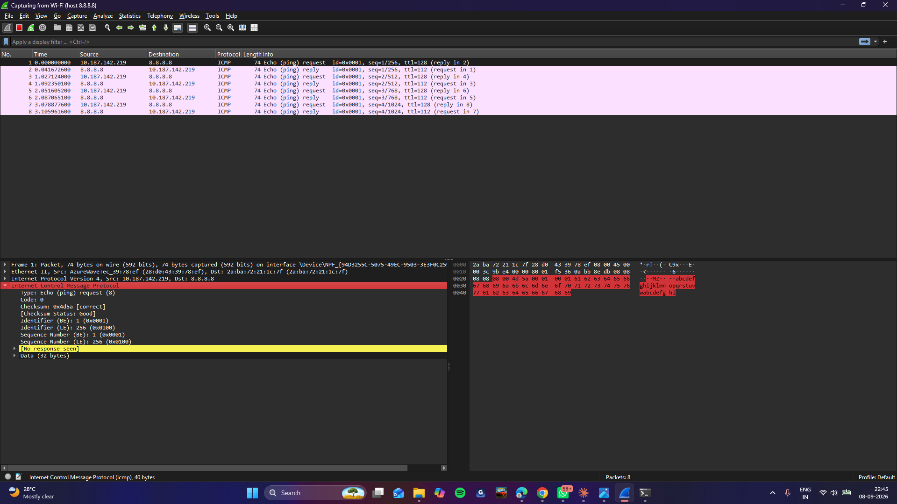
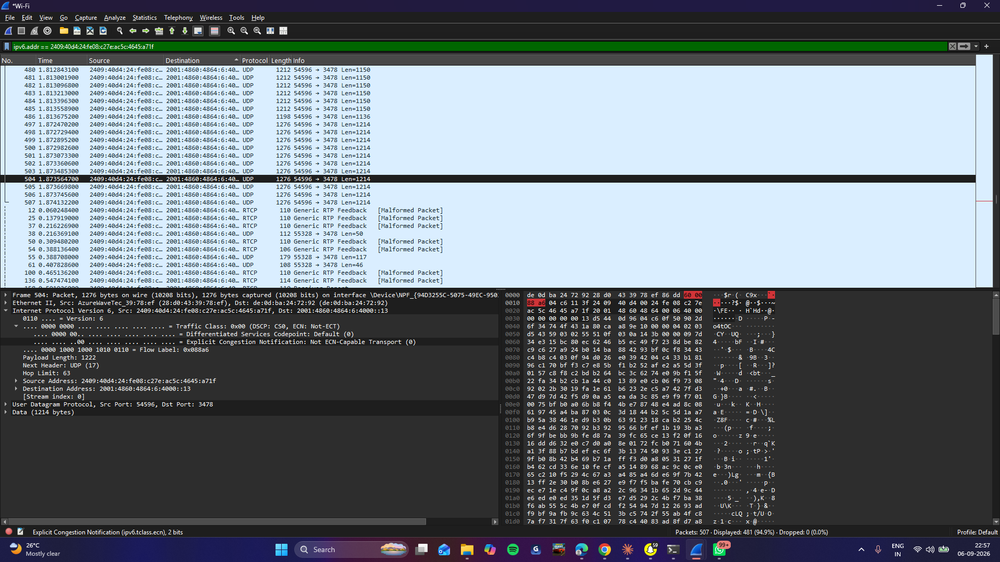

# 01 - Packet Capture

## Goal
Learn the difference between capture filters and display filters, and get comfortable with the basic Wireshark workflow.

## Environment
- Interface: `Wi-Fi` (connected via mobile hotspot)

## Steps performed

### Step 1: Test a capture filter
1. Opened Wireshark, went to Capture → Options, set the capture filter to `host 8.8.8.8`.
2. Started the capture and ran `ping 8.8.8.8` in a terminal.
3. Stopped the capture — only traffic to/from `8.8.8.8` was captured; everything else was excluded before it even hit the packet list.

**Screenshot — capture filter result:**


### Step 2: Test a display filter
4. Started a fresh, unfiltered capture on `Wi-Fi`.
5. Visited a website in the browser, then stopped the capture.
6. Applied a display filter in the filter bar. Since the site resolved over **IPv6**, used `ipv6.addr == <address>` instead of `ip.addr` (which only matches IPv4).

**Screenshot — display filter result:**


### Step 3: Save the capture
7. File → Save As → `01-packet-capture.pcapng`.

## Filters used
```
host 8.8.8.8              (capture filter)
ipv6.addr == <address>    (display filter)
```

## Findings
- **IPv6 over the hotspot:** the site I tested resolved over IPv6 rather than IPv4, so `ip.addr` (IPv4-only) returned nothing — had to switch to `ipv6.addr` to filter correctly. Worth checking the address family in the packet list before assuming a filter will match.
- **Private IP via hotspot NAT:** my Wi-Fi adapter shows a `10.x.x.x` address, which is a private IP range. My phone's hotspot performs NAT between my laptop and the internet, so this is only my internal address on the hotspot's local network — not my real public-facing IP. That's why it's safe to leave visible in screenshots, unlike a genuine public IP.

## Files
- `01-packet-capture.pcapng`
- `screenshots/capture-filter.png`
- `screenshots/display-filter.png`

## Security / networking takeaway
Capture filters discard non-matching packets before they're ever saved (efficient, but you can't change your mind after capturing). Display filters just hide/show from an already-saved capture (flexible, but you need the full capture available). Separately, understanding NAT and address ranges (private vs public) matters for both privacy and reading packet captures correctly — a `10.x.x.x`/`192.168.x.x`/`172.16–31.x.x` address will never appear on the public internet directly.
