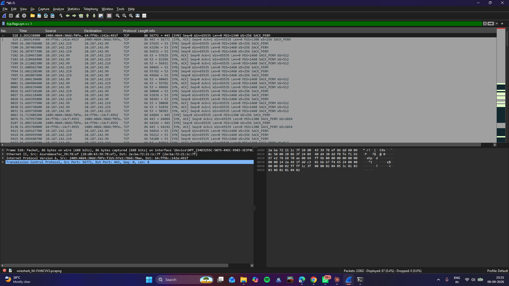
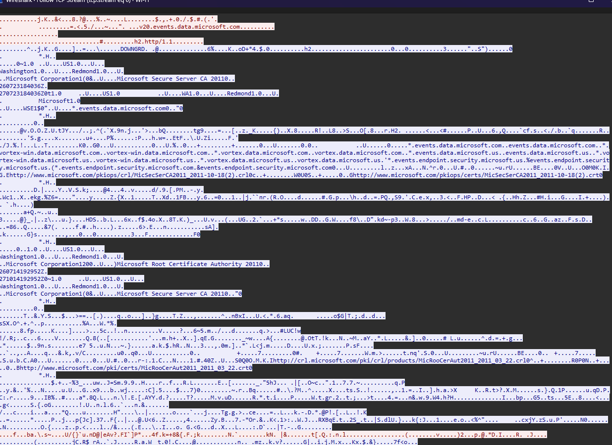
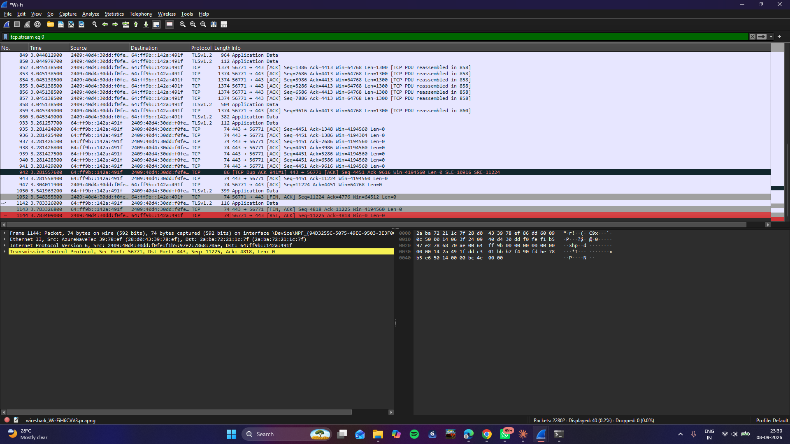

# 02 - TCP Handshake

## Goal
Capture and identify the 3-way handshake and connection teardown.

## Environment
- Interface: `Wi-Fi` (connected via mobile hotspot)
- Traffic generated with: `curl http://neverssl.com`

## Steps performed

### Step 1: Generate a fresh connection
1. Started a capture on `Wi-Fi`.
2. Ran `curl http://neverssl.com` in a terminal, then stopped the capture.

### Step 2: Try isolating the handshake by flags
3. Filtered with `tcp.flags.syn == 1 or tcp.flags.fin == 1` — this showed the SYN and FIN packets, but **not** the final ACK that completes the handshake, since a plain ACK (no SYN/FIN flag) can't be isolated by a flags-only filter — every later data packet also carries just the ACK flag.

### Step 3: Isolate the handshake properly
4. Found the connection's stream number and filtered with `tcp.stream eq N` instead — this showed the full connection in order, with SYN → SYN,ACK → ACK as the first three packets.

**Screenshot — 3-way handshake (SYN, SYN-ACK, ACK):**


### Step 4: Follow the full conversation
5. Right-clicked one of the handshake packets → **Follow → TCP Stream** to view the whole exchange in one window.

**Screenshot — TCP stream follow view:**


### Step 5: Find the teardown
6. Scrolled to the end of the same stream and located the teardown: FIN,ACK from each side, each followed by a plain ACK.

**Screenshot — FIN/ACK teardown:**


### Step 6: Save the capture
7. File → Save As → `02-tcp-handshake.pcapng`.

## Filters used
```
tcp.flags.syn == 1 or tcp.flags.fin == 1
tcp.stream eq N
```

## Handshake sequence
```
Client                     Server
  |------ SYN ------------->|
  |<---- SYN, ACK -----------|
  |------ ACK -------------->|
     [connection established]
```

## Finding
A flags-only filter can't isolate the handshake-completing ACK, since it's indistinguishable by flags alone from any other ACK later in the conversation. Filtering by `tcp.stream` and reading packet order is the reliable way to isolate a handshake end-to-end.

## Files
- `02-tcp-handshake.pcapng`
- `screenshots/handshake.png`
- `screenshots/tcp-stream.png`
- `screenshots/teardown.png`

## Security / networking takeaway
The handshake establishes a reliable, ordered connection before any data flows — and the same visibility that makes it easy to study here is also what lets an attacker fingerprint open ports (see `07-attack-analysis`).
