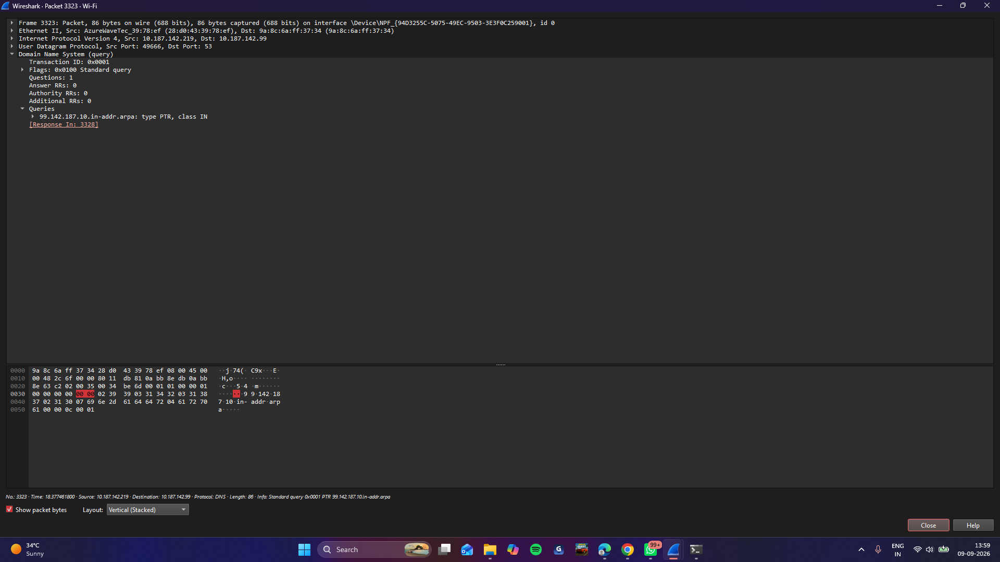
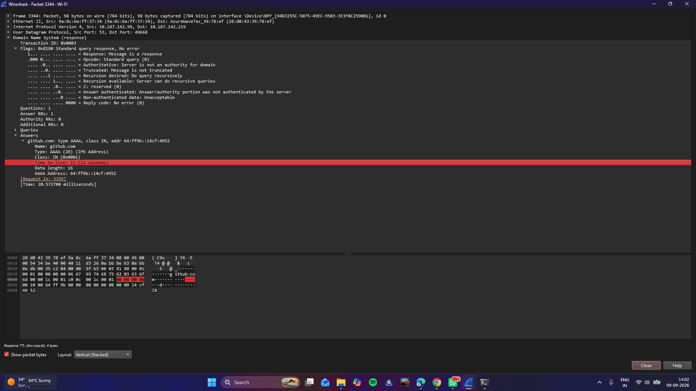
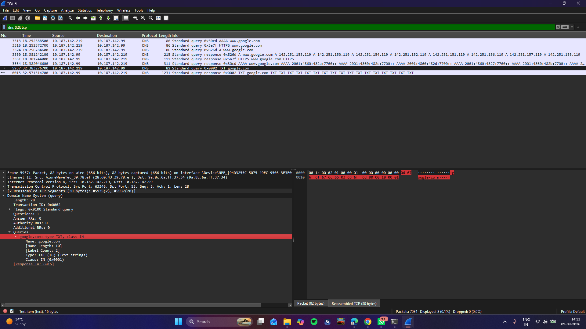

# 03 - DNS

## Goal
Capture and inspect a DNS query/response, and test the UDP-to-TCP fallback behavior.

## Environment
- Interface: `Wi-Fi` (connected via mobile hotspot)

## Steps performed

### Step 1: Force a fresh lookup
1. Flushed the DNS cache: `ipconfig /flushdns`.

### Step 2: Capture a DNS query
2. Started a capture on `Wi-Fi`.
3. Ran `nslookup github.com` in a terminal, then stopped the capture.
4. Filtered with `dns` — showed the query/response pair.

### Step 3: Inspect the query
5. Clicked the query packet → expanded **Domain Name System (query) → Queries** → confirmed `github.com: type A, class IN`.

**Screenshot — DNS query:**


### Step 4: Inspect the response
6. Clicked the response packet → expanded **Domain Name System (response) → Answers** → confirmed the resolved IP and TTL value.

**Screenshot — DNS response:**


### Step 5: Test the UDP-to-TCP fallback
7. Started a new capture, ran `nslookup -type=TXT google.com`.
8. Filtered `dns && tcp` — returned no results (response stayed within UDP's 512-byte limit, no fallback occurred).
9. Confirmed the normal path with `dns && udp`.

**Screenshot — confirming DNS runs over UDP:**


### Step 6: Save
10. File → Save As → `03-dns.pcapng`.

## Filters used
```
dns
dns && tcp     (no results — confirms no fallback needed)
dns && udp     (confirms normal DNS uses UDP)
```

## Finding
The TXT query's response fit within UDP's 512-byte limit, so no TCP fallback occurred. This confirms UDP is DNS's default transport, with TCP reserved for responses too large for a single UDP packet (or zone transfers).

## Files
- `03-dns.pcapng`
- `screenshots/dns-query.png`
- `screenshots/dns-response.png`
- `screenshots/dns-udp.png`

## Security / networking takeaway
DNS responses aren't authenticated by default — anyone on the path could spoof a response before the real one arrives (DNS spoofing/cache poisoning). This is why DNSSEC and encrypted DNS (DoH/DoT) exist.
