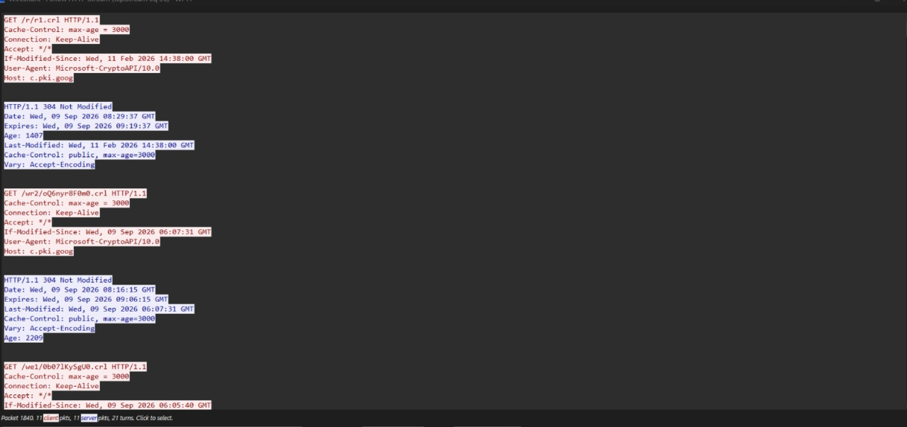
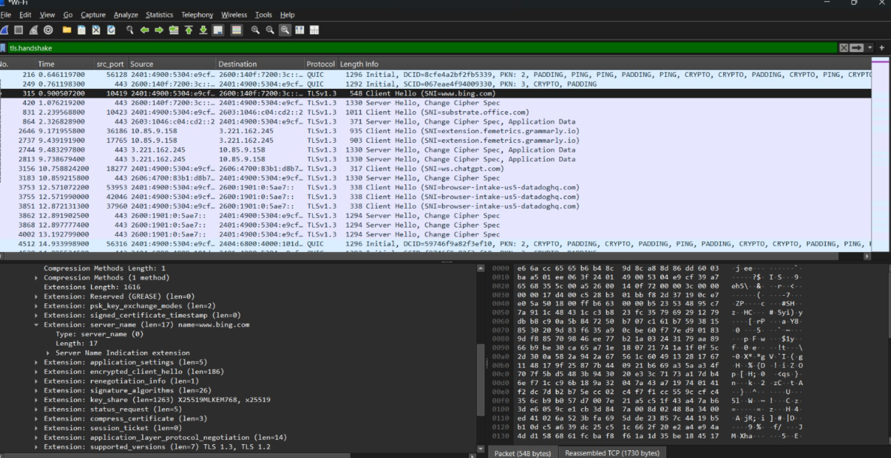
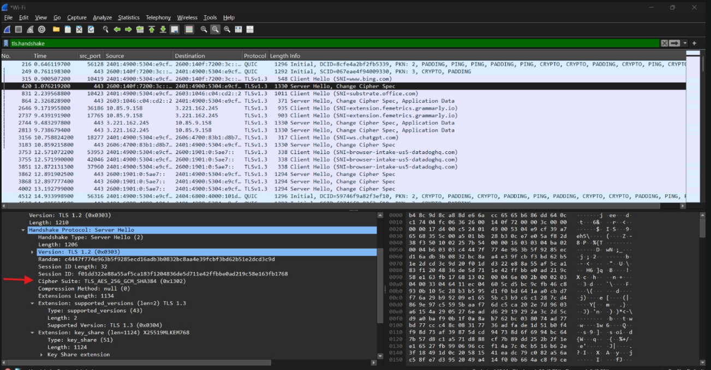
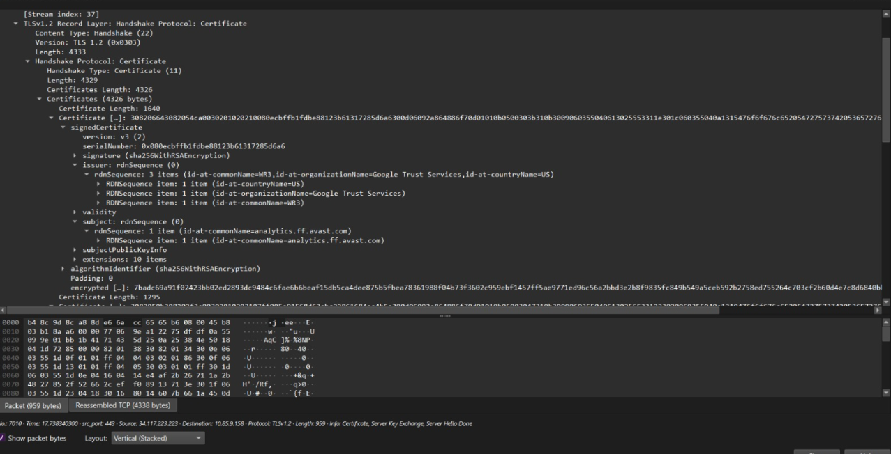
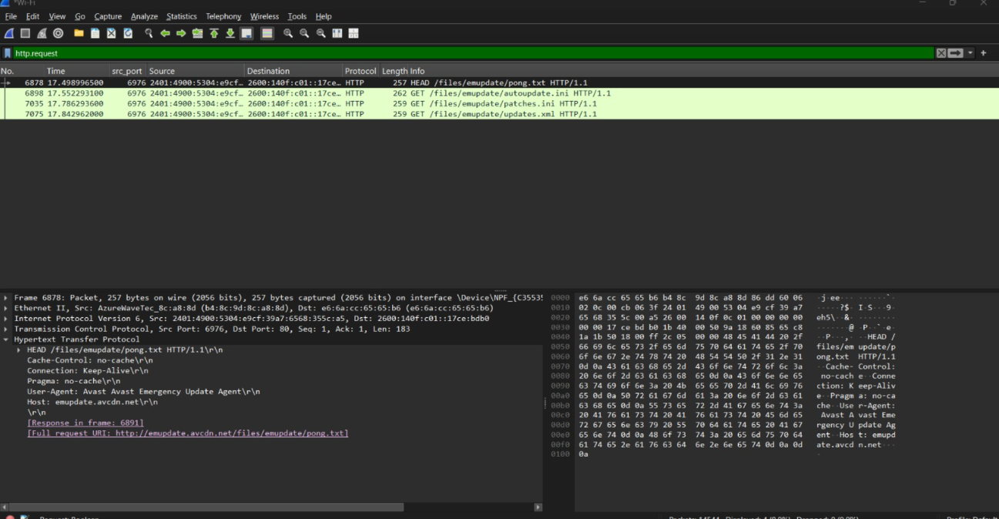

# 04 - HTTP / HTTPS

## Goal
Compare a cleartext HTTP request against an encrypted HTTPS/TLS session.

## Environment
- Interface: `Wi-Fi` (connected via mobile hotspot)

## Part A — HTTP (cleartext)

### Step 1: Capture a plain HTTP request
1. Started a capture on `Wi-Fi`.
2. Visited `http://neverssl.com` in the browser, then stopped the capture.
3. Filtered with `http.request or http.response`.
4. Clicked the `GET /` request → **Follow → TCP Stream** — the full request and response, headers and body, were completely readable in plaintext.

**Screenshot — HTTP stream (plaintext):**


5. Saved as `04a-http.pcapng`.

## Part B — HTTPS (TLS)

### Step 2: Capture an HTTPS session
6. Started a fresh capture on `Wi-Fi`.
7. Visited an HTTPS site, then stopped the capture.
8. Filtered with `tls.handshake`.

### Step 3: Client Hello — SNI visible
9. Clicked the **Client Hello** packet → expanded to the `server_name` extension — the target domain is visible in cleartext even though the session is about to be encrypted.

**Screenshot — Client Hello (SNI):**


### Step 4: Server Hello — cipher suite
10. Clicked the **Server Hello** packet → expanded to see the chosen cipher suite.

**Screenshot — Server Hello (cipher suite):**


### Step 5: Certificate — readable in TLS 1.2
11. Confirmed the site negotiated **TLS 1.2** via the `supported_versions` extension.
12. Clicked the **Certificate** packet → drilled down through `Certificates → Certificate → signedCertificate` — the raw bytes looked like binary noise at first, but this is just DER encoding, not encryption. Expanding further exposed readable `subject`, `issuer`, and `validity` fields.

**Screenshot — Certificate (subject/issuer readable):**


### Step 6: Confirm the payload is encrypted
13. Re-ran `http.request` on this same HTTPS capture — returned **zero results**, proving the payload is encrypted and invisible to Wireshark, unlike Part A.

**Screenshot — empty http.request result:**


14. Saved as `04b-https.pcapng`.

## Filters used
```
http.request or http.response
tls.handshake
http.request     (on the HTTPS capture — returns nothing)
```

## Finding
TLS 1.2 exposes the certificate in cleartext (readable once you expand deep enough into the DER structure), unlike TLS 1.3 where the certificate exchange itself is encrypted. Either way, HTTP content becomes completely invisible to a network observer once TLS is in use — only the SNI domain and cipher suite remain visible.

## Files
- `04a-http.pcapng`
- `04b-https.pcapng`
- `screenshots/http-stream.png`
- `screenshots/client-hello.png`
- `screenshots/server-hello.png`
- `screenshots/certificate.png`
- `screenshots/https-no-http.png`

## Security / networking takeaway
HTTP exposes everything — headers, cookies, form data — to anyone on the path. HTTPS hides the content but still leaks the domain being visited via SNI, which is why encrypted SNI (ECH) is an active area of development.
