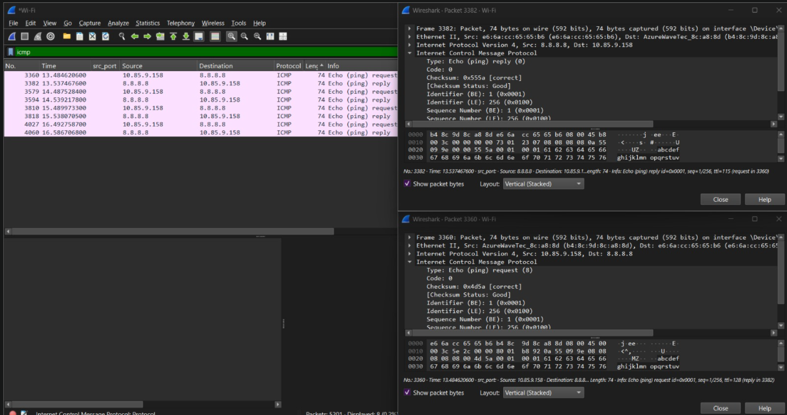
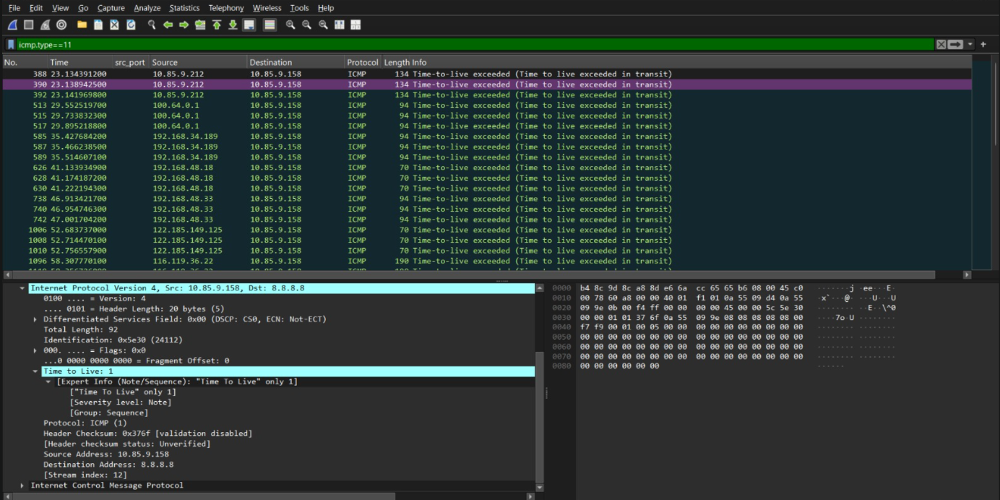

# 05 - ICMP

## Goal
Capture and inspect ICMP Echo Request/Reply (ping), and observe traceroute hops.

## Environment
- Interface: `Wi-Fi` (connected via mobile hotspot)

## Steps performed

### Step 1: Capture a ping
1. Started a capture on `Wi-Fi`.
2. Ran `ping 8.8.8.8` in a terminal, then stopped the capture.
3. Filtered with `icmp`.

### Step 2: Inspect the Echo Request/Reply
4. Clicked an **Echo Request** (Type 8) packet and its matching **Echo Reply** (Type 0) — confirmed the `Identifier` and `Sequence Number` fields match between the two.

**Screenshot — Echo Request / Echo Reply pair:**


### Step 3: Traceroute hops
5. Ran `tracert 8.8.8.8` in a terminal while capturing.
6. Filtered with `icmp.type==11` to isolate **Time-to-Live Exceeded** packets from intermediate hops.

**Screenshot — traceroute TTL-exceeded hops:**


### Step 4: Save
7. File → Save As → `05-icmp.pcapng`.

## Filters used
```
icmp
icmp.type==8    (Echo Request)
icmp.type==0    (Echo Reply)
icmp.type==11   (TTL Exceeded — traceroute hops)
```

## Finding
_(fill in: did all hops resolve, or did some show "Request timed out" due to the mobile hotspot's carrier-grade NAT? Note whichever you observed — both are valid findings.)_

## Files
- `05-icmp.pcapng`
- `screenshots/icmp-echo.png`
- `screenshots/icmp-traceroute.png`

## Security / networking takeaway
ICMP is useful for diagnostics but is also used in reconnaissance (host discovery, OS fingerprinting via TTL) and some denial-of-service techniques (ICMP flood) — many networks rate-limit or block it at the perimeter for this reason.
