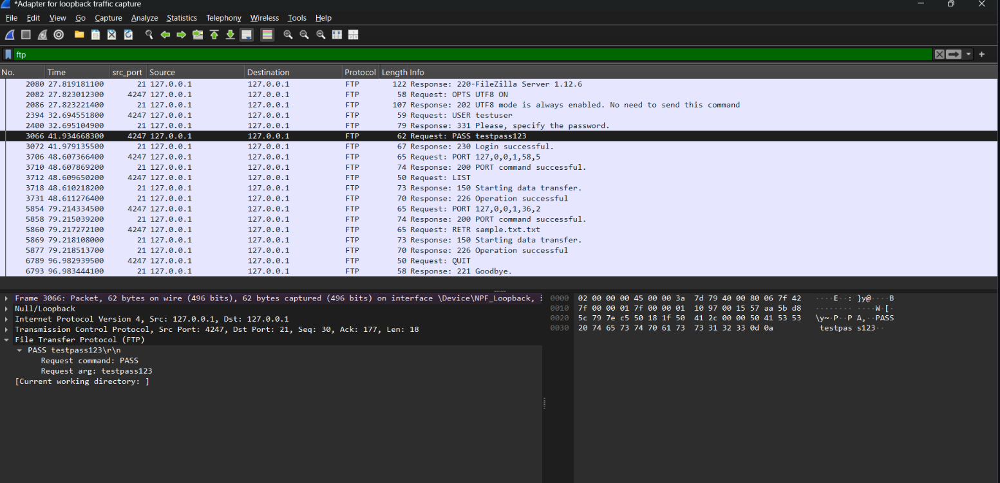
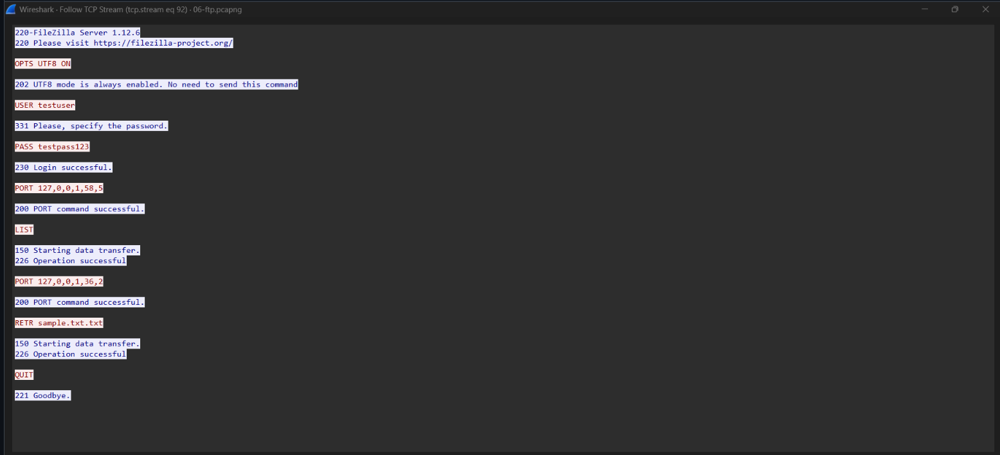

# 06 - FTP

## Goal
Capture an FTP login and file transfer to show that credentials are sent in cleartext.

## Environment
- Interface: `Npcap Loopback Adapter` (`127.0.0.1`) — used instead of Wi-Fi, since the mobile hotspot isolates connected devices from each other, so a local FTP server was used instead.
- Local FTP server: **FileZilla Server 1.12.6**

## Setup

### Step 1: Install and create a user
1. Installed FileZilla Server (separate admin interface: **FileZilla Server Interface**, connects to `127.0.0.1:14148`).
2. Under **Users**, created `testuser` with password `testpass123`.
3. Added a shared folder as a mount point — **Native path** set to the real Windows folder, **Virtual path** set to `/` so the user lands directly in it as their root.
4. Confirmed the server was listening on port **21**.

### Step 2: Work around TLS enforcement
5. First login attempt failed with `503 Use AUTH first.` — FileZilla Server 1.12.6 ships with **Implicit FTP over TLS** enabled by default under **Configuration → FTP over TLS**, which requires a TLS handshake immediately on connect. Windows' built-in `ftp` client doesn't support TLS at all, so the connection was rejected outright (and briefly dropped entirely while implicit mode was still on).
6. Changed the FTP over TLS setting to **"Explicit FTP over TLS and insecure plain FTP"** — this allows a plain-text client to connect and log in normally (TLS becomes opt-in via `AUTH TLS`, which the Windows client never sends), instead of forcing encryption upfront.
7. Retried the login — got `230 Login successful.`

## Steps performed

### Step 3: Capture the session
8. Started a capture on the **Npcap Loopback Adapter**.
9. Connected: `ftp 127.0.0.1`, logged in as `testuser`.
10. Ran `dir` to list the shared folder, then `get sample.txt` to download a test file.
11. Disconnected with `bye`, then stopped the capture.

### Step 4: Inspect the login (control channel)
12. Filtered with `ftp` — found `USER testuser` and `PASS testpass123` sent as **separate, cleartext commands**, fully readable.

**Screenshot — FTP login (cleartext credentials):**


### Step 5: Inspect the file transfer (data channel)
13. Filtered with `ftp-data` — or if the ftp-data is not working then look for the data transfer packet> right click> Follow> TCP Stream. found the actual file content moving over a separate data connection.

**Screenshot — FTP data transfer:**


### Step 6: Save
14. File → Save As → `06-ftp.pcapng`.

## Filters used
```
ftp        (control channel — login, commands)
ftp-data   (data channel — actual file transfer)
```

## Finding
By default, FileZilla Server 1.12.6 enforces **Implicit FTPS**, which blocks plain FTP clients entirely — a good reminder that "FTP" and "FTPS" aren't just a flag on the same protocol, but different negotiation models (Implicit forces TLS before any commands; Explicit allows plain-text FTP unless the client opts into `AUTH TLS`). Once switched to allow plain FTP, the `USER`/`PASS` sequence was fully visible in cleartext, confirming FTP has no credential protection by default.

## Files
- `06-ftp.pcapng`
- `screenshots/ftp-login.png`
- `screenshots/ftp-data.png`

## Security / networking takeaway
FTP sends usernames and passwords unencrypted — anyone who can see the traffic can capture credentials directly, exactly as demonstrated here. This is why FTPS/SFTP (which wrap the exchange in encryption) are the recommended alternatives — and why modern FTP servers increasingly default to requiring TLS, as seen firsthand while setting this up.
