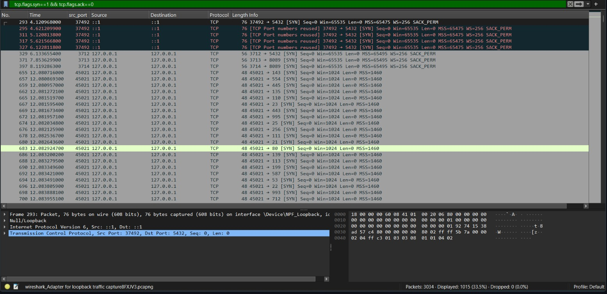
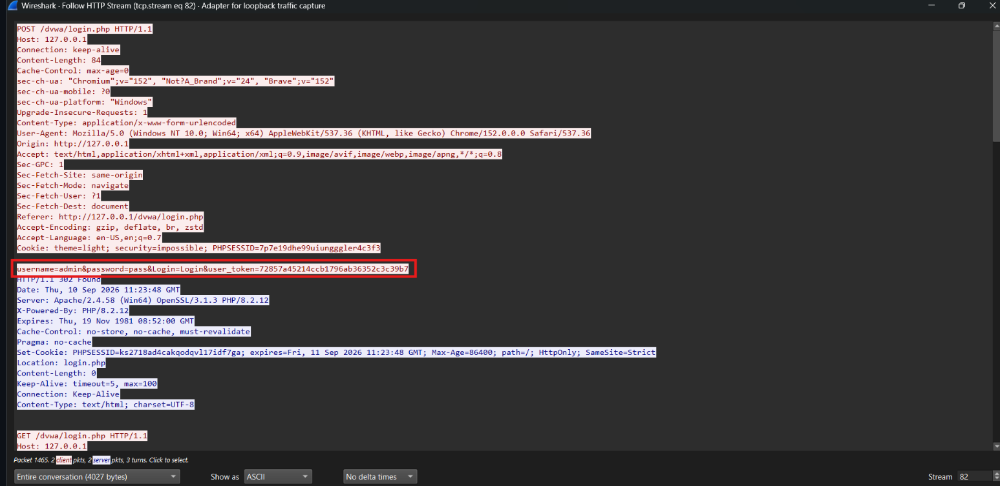
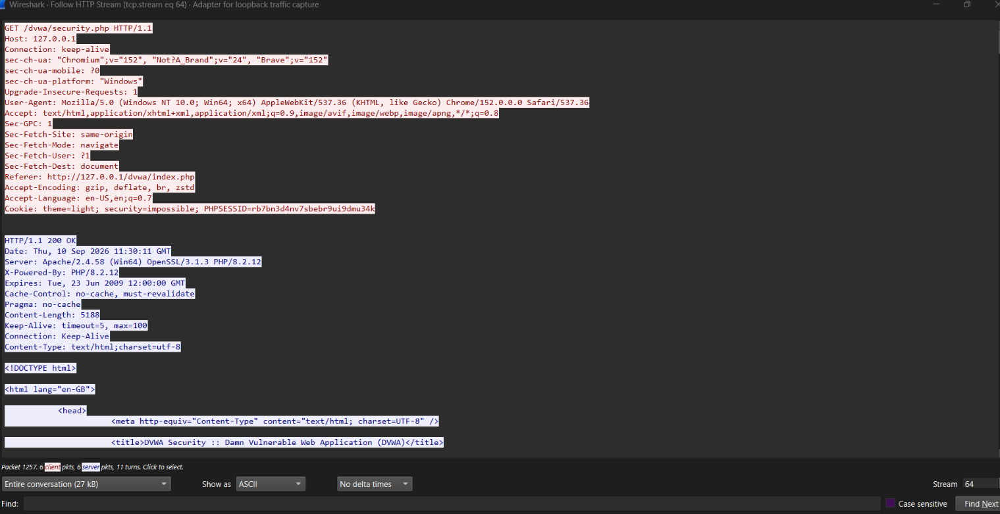
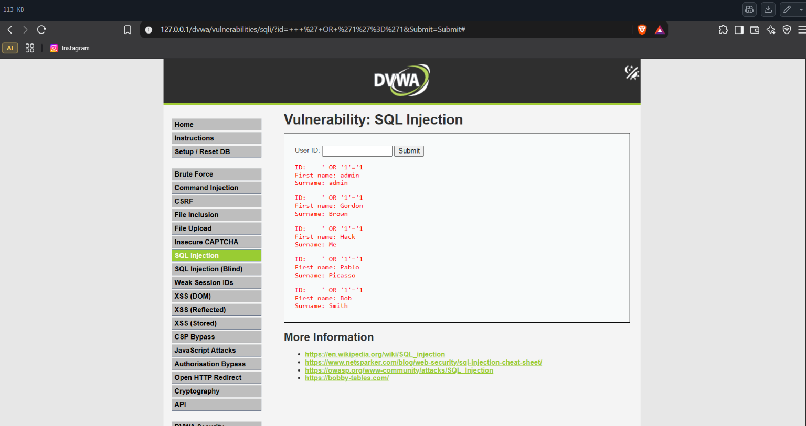

# 07 - Attack Analysis

## Goal
Capture and identify the traffic signatures of a port scan, a brute-force login attempt, and a SQL injection request.

## Environment
- Interface: `Adapter for loopback traffic capture` (`127.0.0.1`) — used instead of Wi-Fi, since the mobile hotspot isolates connected devices, so the target is a locally hosted vulnerable app instead.
- Target: XAMPP + DVWA running on `127.0.0.1`
- Tool: Nmap (reused from the Nmap-Network-Reconnaissance project)

## Setup
1. Installed XAMPP into a custom project folder, started Apache + MySQL from the control panel.
2. Installed DVWA into `htdocs/dvwa`. The downloaded config template used environment-variable-based defaults (`db_user: dvwa`, `db_password: p@ssw0rd`) which don't match XAMPP's default MySQL account — changed `config.inc.php` to use `db_user: root` / `db_password: ''` to match XAMPP's defaults.
3. Ran `setup.php` → **Create / Reset Database** → redirected to login.
4. Logged in (`admin` / `password`), set **DVWA Security** to **Low**.

---

## 7a. Port scan visibility (Nmap)

### Steps performed
1. Started a capture on the loopback adapter.
2. Ran `nmap -sS -p 1-1000 127.0.0.1` (as Administrator) — **before** starting Apache.
3. Result: port 80 (Apache) did **not** appear as open, since Apache wasn't running yet.
4. Started Apache in XAMPP, re-ran the same scan.
5. Result: ports **80** and **443** now appeared open, confirming the scan accurately reflects live service state in real time.
6. Filtered the second capture with `tcp.flags.syn==1 && tcp.flags.ack==0`.

**Screenshot — SYN packet burst (open ports 80, 443 included):**


7. Saved as `07a-port-scan.pcapng`.

### Scan results
```
PORT    STATE    SERVICE
21/tcp  open     ftp              (FileZilla Server, from Topic 6)
80/tcp  open     http             (Apache, once started)
135/tcp open     msrpc            (Windows service)
137/tcp filtered netbios-ns
443/tcp open     https            (Apache, once started)
445/tcp open     microsoft-ds     (Windows service)
902/tcp open     iss-realsecure   (actually VirtualBox, mislabeled by Nmap)
912/tcp open     apex-mesh        (actually VirtualBox, mislabeled by Nmap)
```

### Finding
Running the scan before and after starting Apache showed the scan directly reflects which services are actually live — ports 80/443 only appeared once Apache was started, making the "before/after" comparison a clear demonstration of what a SYN scan reveals about a target's real-time state. Filtering `tcp.flags.syn==1 && tcp.flags.ack==0` isolates the scan's SYN packets from the responses, showing the sequential-port pattern that's characteristic of a scan (vs normal browsing traffic, which targets one port repeatedly).

---

## 7b. Brute-force pattern (DVWA login)

### Steps performed
1. Started a capture on the loopback adapter.
2. Submitted the DVWA login form (`http://127.0.0.1/dvwa/login.php`) several times with username `admin` and a few incorrect passwords, followed by the correct one.
3. Stopped the capture.
4. Filtered with `http.request.method == "POST" && http.request.uri contains "login"`.

**Screenshot — repeated login POST requests:**


5. Saved as `07b-brute-force.pcapng`.

### Finding
Each login attempt produced a distinct POST request to the same URI (`login.php`) with only the `password` field changing — a clear, repeatable signature that distinguishes a brute-force attempt from normal traffic, even without seeing the actual outcome of each attempt.

---

## 7c. SQL Injection request

### Steps performed
1. Started a capture on the loopback adapter.
2. In DVWA's **SQL Injection** module, submitted the payload `' OR '1'='1` into the User ID field.
3. The resulting request was a GET (DVWA's SQLi module uses GET by default):
   ```
   http://127.0.0.1/dvwa/vulnerabilities/sqli/?id=+++%27+OR+%271%27%3D%271&Submit=Submit#
   ```
   which decodes to `id =    ' OR '1'='1`.
4. The page returned multiple dumped user records instead of matching a single ID — confirming the `OR '1'='1'` clause made the underlying SQL query always true.
5. Stopped the capture, filtered `http.request`, followed the HTTP stream.

**Screenshot — injected payload in the request + dumped data in the response:**



6. Saved as `07c-sql-injection.pcapng`.

### Finding
The injection payload is fully visible in plaintext in the request URL/query string, and the dumped data (multiple users instead of one) is equally visible in the plaintext HTTP response — since this traffic isn't encrypted, both the attack and its result are trivially observable to anyone capturing the traffic, exactly like the FTP credentials in Topic 6.

---

## Filters used
```
tcp.flags.syn==1 && tcp.flags.ack==0                       (port scan)
http.request.method == "POST" && http.request.uri contains "login"   (brute-force)
http.request                                                (SQL injection)
```

## Files
- `07a-port-scan.pcapng`
- `07b-brute-force.pcapng`
- `07c-sql-injection.pcapng`
- `screenshots/port-scan.png`
- `screenshots/brute-force.png`
- `screenshots/sql-injection.png`

## Security / networking takeaway
Each of these attacks has a distinct, visible pattern in raw traffic — repeated SYNs to sequential ports, repeated POSTs with varying credentials, or an obvious injected payload in a request — which is exactly the basis for how IDS/IPS and SIEM tools detect attacks from network traffic rather than needing to know the outcome in advance.
